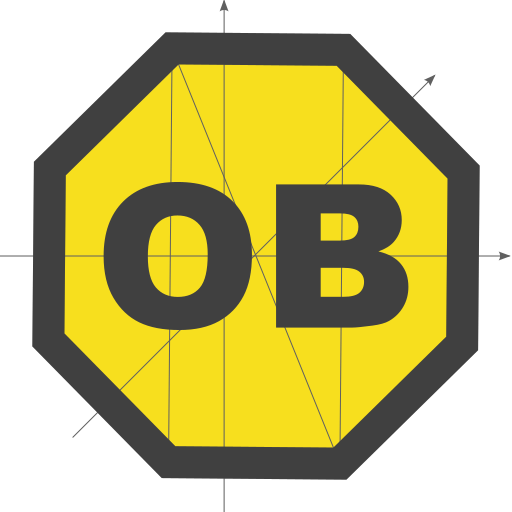

# OB

Accessors: getters, setters, deleters

A small utility library for dealing with objects

## Examples

```javascript
const object = {
  a:   1,
  b:   2,
  c:   3,
  d:   null,
  key: 'val',
  obj: {a: 11, b: 22, c: {}, d: null},
  arr: [1, 2, 3, {a: 111, b: 222}],
};

console.log(
  OB.get.ko('key', object),           // val
  OB.get.ok(object, 'key'),           // val

  OB.nav('arr.3.b', object),          // 222
  OB.nav(['arr', 3, 'b'], object),    // 222

  OB.nav('obj.d.e', object),          // null
  OB.nav('obj.d.1.2.3', object),      // null
  OB.nav('obj.c.1.2.3', object),      // undefined
);


const o = {};

console.log(
  OB.set.kvo$('k1', 'v1', o),     // { k1: 'v1' }
  OB.set.kvo('k22', 'v2', o),     // { k1: 'v1', k22: 'v2' }
  o,                              // { k1: 'v1' }
  OB.set.okv(o, 'k1', 'val'),     // { k1: 'val' }
  o,                              // { k1: 'v1' }
);

console.log(OB.del.ok(o, 'k1'));    // {}
console.log(o);                     // { k1: 'v1' }
console.log(OB.del.ko$('k1', o));   // {}
console.log(o);                     // {}
```
